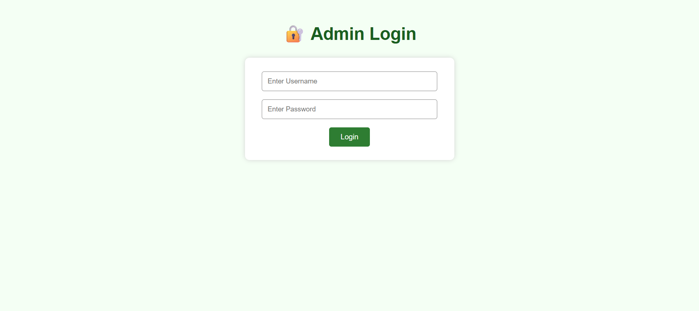
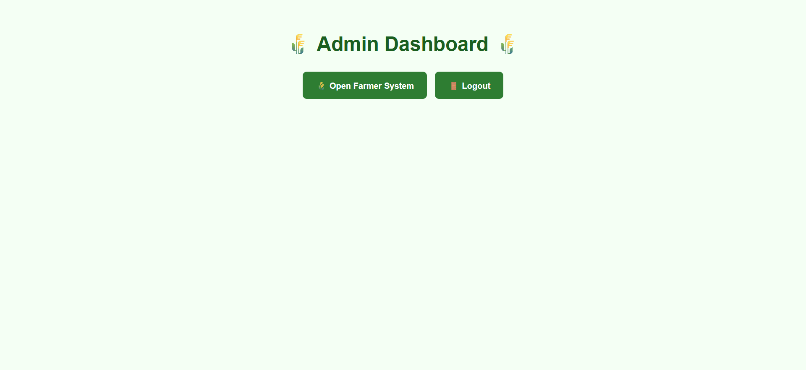
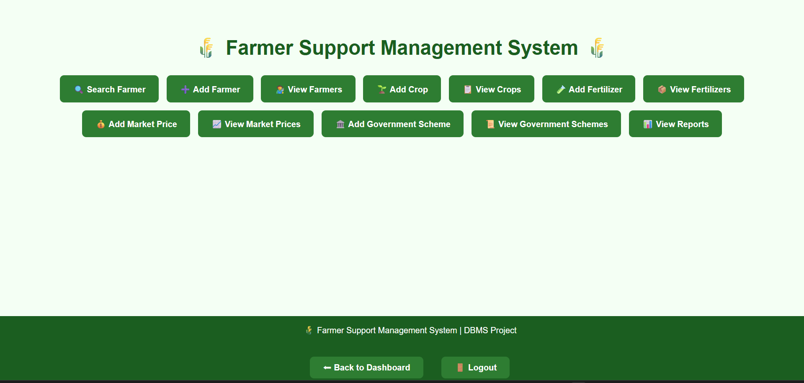
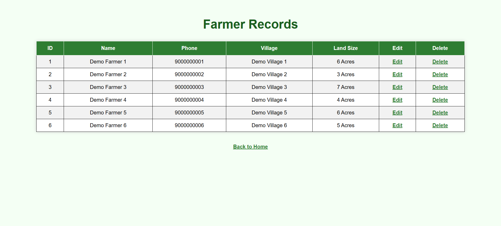
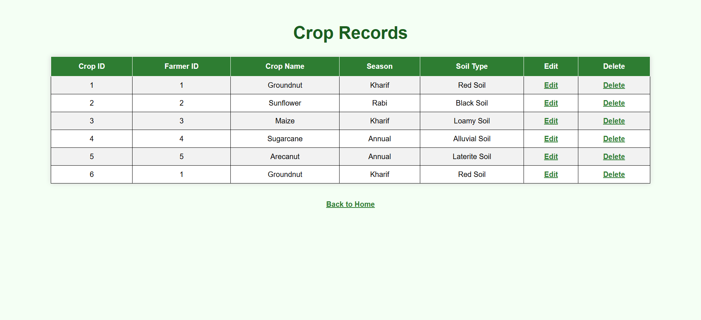
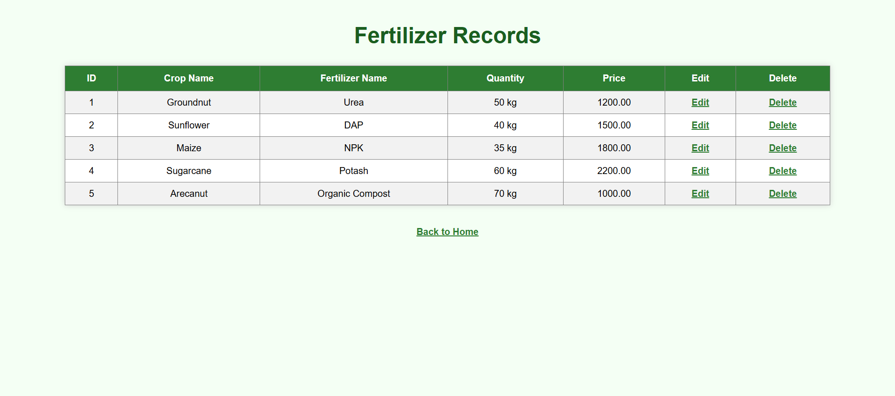
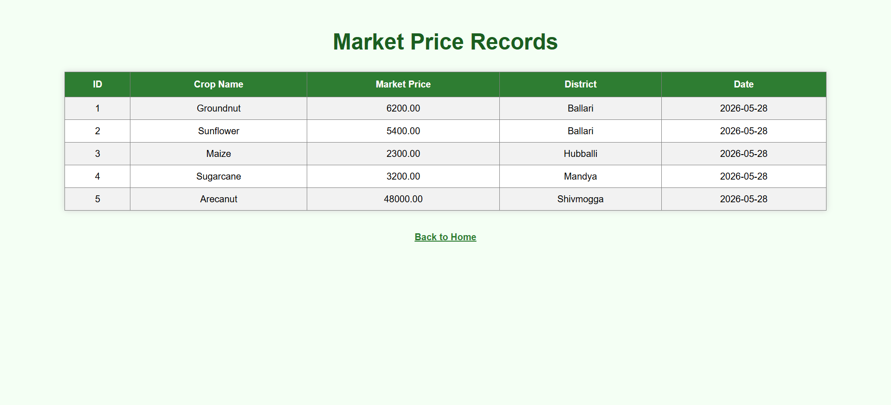
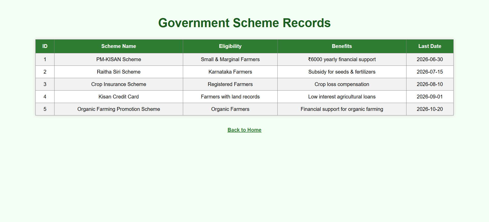
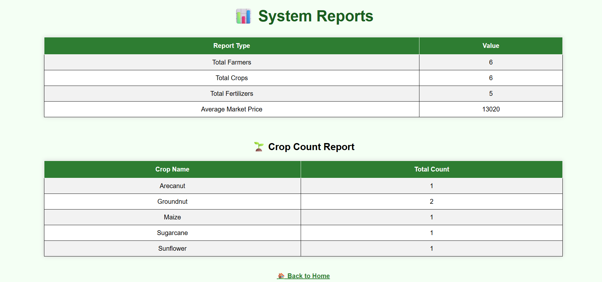

# 🌾 Farmer Support Management System

A database-driven web application developed as a **DBMS academic project** to manage farmer information and provide organized access to agricultural resources such as crops, fertilizers, market prices, and government schemes.

The system provides an admin-based interface connected to a MySQL relational database and is currently designed to run locally using **XAMPP**.

---

## 📌 Project Overview

The **Farmer Support Management System** is designed to centralize and manage important agricultural information through a structured database.

The system allows an administrator to:

- 👨‍🌾 Manage farmer records
- 🌱 Manage crop information
- 🧪 Manage fertilizer information
- 💰 Manage agricultural market prices
- 🏛️ Manage government schemes
- 🔍 Search farmer records
- 📊 View reports
- 🔐 Authenticate through an admin login system

---

## 🎯 Objectives

The main objectives of this project are:

- To design and implement a relational database for agricultural information.
- To provide CRUD operations for managing records.
- To organize farmer, crop, fertilizer, market price, and scheme information.
- To provide a simple web-based interface for database interaction.
- To demonstrate practical implementation of DBMS concepts using PHP and MySQL.

---

## 🛠️ Technologies Used

| Technology | Purpose |
|---|---|
| **HTML** | Web page structure |
| **CSS** | User interface styling |
| **PHP** | Backend development and server-side logic |
| **MySQL** | Relational database |
| **XAMPP** | Local Apache and MySQL server |
| **phpMyAdmin** | Database management |

---

## ✨ Features

### 🔐 Admin Authentication

- Admin login system
- Session-based authentication
- Secure password hashing using PHP `password_hash()` and `password_verify()`
- Prepared SQL statements for database queries
- Logout functionality

### 👨‍🌾 Farmer Management

- Add farmer records
- View farmer records
- Edit farmer information
- Delete farmer records
- Search for farmers

### 🌱 Crop Management

- Add crop records
- View crop records
- Edit crop information
- Delete crop records

### 🧪 Fertilizer Management

- Add fertilizer records
- View fertilizer records
- Edit fertilizer records
- Delete fertilizer records

### 💰 Market Price Management

- Add market price information
- View available market prices

### 🏛️ Government Schemes

- Add government scheme information
- View available agricultural schemes

### 📊 Reports

- View organized information through the reports section

---

## 🗄️ Database Structure

The project uses a MySQL relational database named:

```text
farmer_support_db
```

The database contains the following tables:

```text
admin
farmers
crops
fertilizers
government_schemes
market_prices
```

### Database Concepts Used

- Primary keys
- Foreign keys
- Auto-increment fields
- Relational tables
- CRUD operations
- SQL queries
- Database connectivity using PHP
- Prepared statements

---

## 🔗 Database Relationship

The system maintains relationships between relevant entities.

For example:

```text
Farmers
   │
   │ farmer_id
   ↓
Crops
```

This allows crop information to be associated with the corresponding farmer.

---

## 📂 Project Structure

```text
FARMER_SUPPORT_SYSTEM/
│
├── database/
│   └── farmer_support_db_github.sql
│
├── screenshots/
│   ├── crops.png
│   ├── dashboard.png
│   ├── farmer_support_system.png
│   ├── farmers.png
│   ├── fertilizers.png
│   ├── login.png
│   ├── market_prices.png
│   ├── reports.png
│   └── schemes.png
│
├── .gitignore
├── add_crop.php
├── add_farmer.php
├── add_fertilizer.php
├── add_market_price.php
├── add_scheme.php
├── dashboard.php
├── db.php
├── delete_crop.php
├── delete_farmer.php
├── delete_fertilizer.php
├── edit_crop.php
├── edit_farmer.php
├── edit_fertilizer.php
├── farmers.php
├── index.php
├── login.php
├── logout.php
├── README.md
├── reports.php
├── search_farmer.php
├── style.css
├── view_crops.php
├── view_farmers.php
├── view_fertilizers.php
├── view_market_prices.php
└── view_schemes.php
```

---

## ⚙️ How to Run the Project Locally

This project is currently designed to run locally using **XAMPP**.

### 1. Install XAMPP

Install XAMPP with:

- Apache
- MySQL

### 2. Start XAMPP

Open the XAMPP Control Panel and start:

- Apache
- MySQL

### 3. Copy the Project

Place the project folder inside the XAMPP `htdocs` directory:

```text
xampp/htdocs/
```

The final path should look like:

```text
xampp/htdocs/FARMER_SUPPORT_SYSTEM/
```

### 4. Create the Database

Open phpMyAdmin:

```text
http://localhost/phpmyadmin
```

Create a new database named:

```text
farmer_support_db
```

### 5. Import the Database

Select:

```text
farmer_support_db
```

Then select:

**Import**

Choose:

```text
database/farmer_support_db_github.sql
```

and import the SQL file.

### 6. Configure the Database Connection

Open:

```text
db.php
```

Make sure the database connection uses:

```php
$conn = mysqli_connect("localhost", "root", "", "farmer_support_db");
```

If your MySQL username, password, or database configuration is different, update the connection details accordingly.

### 7. Run the Application

Open your browser and visit:

```text
http://localhost/FARMER_SUPPORT_SYSTEM/
```

---

## 🔑 Demo Login

The repository contains a **demo administrator account** for testing the application.

```text
Username: demo_admin
Password: zxMT9j%!ZZ^^WL^QjlP1
```

> **Note:** This is a disposable demo account intended only for testing this academic project. Do not reuse this password for any personal or real-world account.

---

## 📸 Screenshots

### 🔐 Admin Login



### 📊 Dashboard



### 🏠 System Overview



### 👨‍🌾 Farmer Management



### 🌱 Crop Management



### 🧪 Fertilizer Management



### 💰 Market Prices



### 🏛️ Government Schemes



### 📊 Reports



---

## 🔒 Security Improvements

The authentication system was improved during the development of this project.

The current implementation includes:

- Password hashing using PHP `password_hash()`
- Password verification using `password_verify()`
- Prepared SQL statements
- Session-based authentication
- Logout functionality

These measures improve the security of the application's authentication system compared with storing and directly comparing plain-text passwords.

---

## 📌 Current Project Status

**Project Status:** Completed Academic DBMS Project

**Deployment Status:** Local deployment using XAMPP

The application is currently **not deployed online** and runs through a local Apache/PHP/MySQL environment.

---

## 🚀 Future Enhancements

Possible future improvements include:

- 🌐 Online deployment
- 👨‍🌾 Farmer-side user accounts
- 📱 Responsive mobile interface
- 📈 Advanced agricultural analytics
- 💹 Real-time market price updates
- 🔔 SMS/email notifications
- 🔑 Role-based access control
- ☁️ Cloud database integration
- 📊 Interactive data visualization

---

## 🎓 Project Information

| Detail | Information |
|---|---|
| **Project** | Farmer Support Management System |
| **Type** | DBMS Academic Project |
| **Backend** | PHP |
| **Database** | MySQL |
| **Server** | XAMPP |

---

## 👩‍💻 Developed By

**Dasari Anjali**

---

⭐ If you find this project useful, feel free to explore the repository and learn from the implementation.